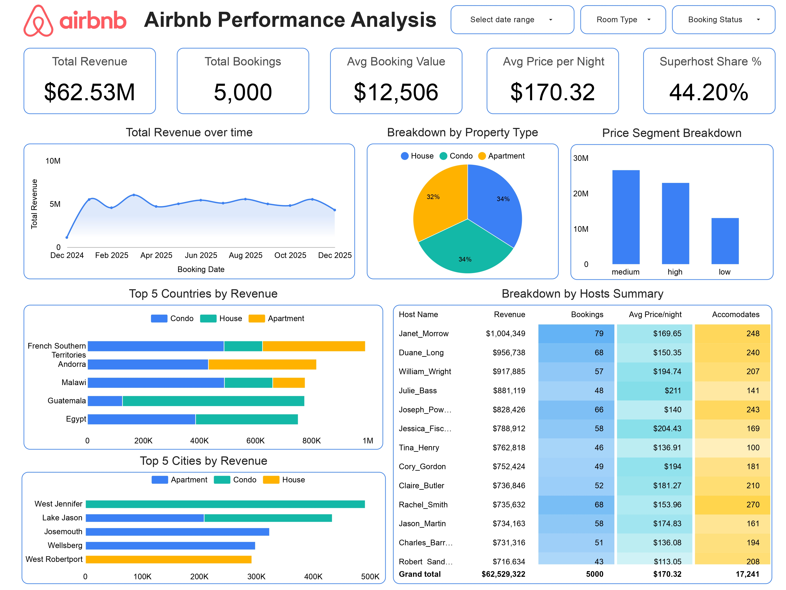

<div align="center">


# Airbnb Data Engineering & Analytics Pipeline

**End-to-end cloud data pipeline — from raw CSVs to executive dashboards**


*Ingests Airbnb CSV data from AWS S3 → loads into Snowflake → transforms via dbt (Bronze → Silver → Gold) → serves insights through Looker Studio*

</div>

---

## 📋 Table of Contents

- [Project Overview](#-project-overview)
- [Dashboard](#-dashboard)
- [Architecture & Tech Stack](#-architecture--tech-stack)
- [What Makes This Project Unique](#-what-makes-this-project-unique)
- [Key Design Decisions](#-key-design-decisions)
- [Dataset Details](#-dataset-details)
- [Data Flow](#-data-flow)
- [Project Setup Guide](#-project-setup-guide)
- [dbt Transformations — Full Coverage](#-dbt-transformations--full-coverage)
- [Looker Studio — Dashboard Details](#-looker-studio--dashboard-details)
- [How to Run the Pipeline](#-how-to-run-the-pipeline)
- [Future Improvements & Scope](#-future-improvements--scope)

---

## 🔍 Project Overview

### Objective

Build a production-grade analytics engineering pipeline that takes raw, messy Airbnb data and transforms it into clean, trustworthy, analytics-ready datasets — served through an executive dashboard.

### Business Context

Raw Airbnb data is not directly analysis-ready. It suffers from quality issues, mixed granularity, missing values, and operational complexity. Business teams need reliable KPIs like **total revenue**, **average booking value**, **superhost performance**, and **market-level breakdowns** — but they can't get them from raw CSVs.

This project solves that by creating a fully reproducible pipeline that standardizes ingestion from cloud storage, applies business transformations with built-in data quality checks, supports historical tracking through SCD Type 2 snapshots, and exposes consistent, analytics-ready datasets for BI reporting.

---

## 📊 Dashboard (Looker Studio)

<div align="center">



<br /><br />

[](https://lookerstudio.google.com/reporting/713b7567-f53d-47a1-8ecd-9fc900541e72)

</div>

---

## 🏗 Architecture & Tech Stack

<div align="center">


</div>

<br />

| Layer | Technology | Purpose |
|-------|-----------|---------|
| **Storage** | AWS S3 | Cloud storage for raw CSV source files |
| **Access Control** | AWS IAM | Least-privilege access policies for S3 |
| **Data Warehouse** | Snowflake | Scalable cloud warehouse for all data layers |
| **Transformation** | dbt Core + dbt-snowflake | Layered SQL transformations with testing |
| **Language** | SQL + Jinja | Models, macros, and dynamic SQL generation |
| **Environment** | `uv` | Fast Python dependency & environment management |
| **Dashboarding** | Looker Studio | Executive-facing interactive dashboard |

---

## ✨ What Makes This Project Unique

This isn't just an ETL pipeline — it's a **complete analytics engineering system** designed with production patterns in mind.

### 🔄 SCD Type 2 Historical Tracking

Dimension tables (`DIM_BOOKINGS`, `DIM_LISTINGS`, `DIM_HOSTS`) use **dbt snapshots** with `dbt_valid_from` / `dbt_valid_to` columns to capture every historical change. If a host gains superhost status or a listing changes price, the history is preserved — not overwritten. This enables true **point-in-time analytics** that most simple ETL pipelines lose.

**Why this matters:** Without SCD2, a host's superhost status change would silently overwrite the previous record. With it, you can answer questions like *"What was the superhost share in Q2 vs. Q3?"* or *"How did a listing's price change affect its booking volume over time?"* — queries that require historical dimension state.

### 🥉🥈🥇 Bronze → Silver → Gold Layered Architecture

A production-grade medallion architecture ensures clear separation of concerns:

- **Bronze** — Raw ingestion and type casting. No business logic. Acts as a controlled entry point so upstream schema changes are isolated here.
- **Silver** — Cleaning, deduplication, derived fields, null handling. This is where data becomes trustworthy.
- **Gold** — Analytics-ready datasets optimized for consumption. Business users and dashboards only ever touch this layer.

**Why this matters:** Each layer is independently testable, debuggable, and maintainable. If a data quality issue appears in Gold, you trace it back through Silver to Bronze — not through a tangled monolith of CTEs.

### 📐 Dual Consumption Patterns — OBT + Star Schema

The Gold layer supports two consumption models side by side:

- **OBT (One Big Table)** — A wide, denormalized table where every dimension is pre-joined. Optimized for fast Looker Studio rendering and ad-hoc exploration. No joins needed at query time.
- **Star Schema** (`FACT` + `DIM_*`) — Normalized structure with a central fact table and separate dimension tables. Provides cleaner semantics, easier governance, and scalability for enterprise use cases and role-based access.

**Why both?** OBT is materialized as a **table** (not a view) because Looker Studio performs significantly better when scanning a single pre-computed table versus executing multi-table joins at query time. The star schema exists alongside it for analysts who need flexibility or for downstream systems that benefit from normalized data.

### 🧪 Built-In Data Quality Testing

dbt tests validate data at every layer — uniqueness on business keys, not-null constraints, referential integrity between fact and dimension tables, and accepted value checks on categorical fields like `BOOKING_STATUS`. Tests run as part of `dbt build`, meaning **no model reaches Gold without passing quality gates**.

### 🧩 Reusable Jinja Macros

Custom macros reduce repetitive SQL and enforce consistency across models. Rather than copy-pasting the same CASE logic or column transformations across 9+ model files, macros centralize that logic so a single change propagates everywhere. See the [Custom Macros](#custom-macros) section for details and code examples.

---

## 🧠 Key Design Decisions

Every tool and pattern choice in this project was made intentionally. This section explains the *why* behind the key decisions.

### Why Ephemeral Models for Gold Intermediates?

The `gold/ephemeral/` folder contains intermediate models (`bookings.sql`, `hosts.sql`, `listings.sql`) materialized as **ephemeral** — meaning they compile as CTEs inlined into the downstream Gold models, not as physical tables or views in Snowflake.

**Reasoning:** These intermediates exist purely to prepare dimension-level logic (joins, filters, derivations) before they feed into `obt.sql` and `fact.sql`. Materializing them as tables would create unnecessary storage and maintenance overhead for objects that no one queries directly. Ephemeral keeps the DAG clean while giving us modular, testable SQL files.

```
ephemeral/bookings.sql  ──┐
ephemeral/hosts.sql     ──┼──▶  obt.sql (materialized as TABLE)
ephemeral/listings.sql  ──┘     fact.sql (materialized as TABLE)
```

### Why External Stage over Storage Integration?

Snowflake supports two patterns for loading from S3: **external stages** (with credentials passed at copy time) and **storage integrations** (IAM role-based trust between Snowflake and AWS).

This project uses an **external stage** for simplicity and portability — it works out of the box without requiring Snowflake ACCOUNTADMIN-level setup or cross-account IAM trust configuration. For a production deployment, upgrading to a **storage integration with IAM roles** is recommended (no credentials in SQL, automatic credential rotation, tighter security boundary).

### Why `generate_schema_name` Macro?

By default, dbt writes all models to a single schema (whatever's in `profiles.yml`). This project overrides `generate_schema_name` to **route models to separate Snowflake schemas based on their layer** — Bronze models land in `AIRBNB.BRONZE`, Silver in `AIRBNB.SILVER`, Gold in `AIRBNB.GOLD` — not all piled into `AIRBNB.DEV`.

This mirrors production data warehouse conventions where each layer has its own schema with separate access controls, and makes it trivial to grant BI tools read-only access to Gold while restricting Bronze/Silver. See [`macros/generate_schema_name.sql`](airbnb_dbt_pipeline/macros/generate_schema_name.sql) for the implementation.

### Why OBT Is Materialized as a Table (Not a View)?

The OBT joins three dimensions with the fact table — a query pattern that Looker Studio would execute on every single dashboard load if OBT were a view. By materializing it as a **table**, Snowflake computes the joins once during `dbt run`, and all subsequent dashboard queries are simple scans against a pre-built result set.

**Impact:** Faster dashboard rendering, lower Snowflake compute costs (no repeated joins), and more predictable query performance for end users.

### Why IAM Least-Privilege with Scoped S3 Policies?

The IAM policy intentionally separates `s3:ListBucket` (on the bucket) from `s3:GetObject` (scoped to the `source/` prefix only). This ensures Snowflake can list and read source files but **cannot access other prefixes** in the bucket, write objects, or delete anything. This is a security best practice that limits blast radius if credentials are ever compromised.

---

## 📁 Dataset Details

The pipeline ingests three core Airbnb datasets stored as CSVs in S3, totaling over **5,000+ rows** across all sources:

| Table | Description |
|-------|-------------|
| **Bookings** | Reservation records including dates, status, pricing, and duration |
| **Listings** | Property details — type, room type, nightly rate, city, and country |
| **Hosts** | Host profiles with superhost status and join date |

---

## 🔀 Data Flow

```
                         ┌──────────────────────────────────┐
                         │       AWS S3 Bucket               │
                         │  s3://airbnb-etl-pipeline/source/ │
                         │                                    │
                         │  📄 bookings.csv                  │
                         │  📄 listings.csv                  │
                         │  📄 hosts.csv                     │
                         └──────────────┬───────────────────┘
                                        │
                          Snowflake STAGE + COPY INTO
                                        │
                                        ▼
                         ┌──────────────────────────────────┐
                         │       Snowflake Raw Tables        │
                         │  BOOKINGS | LISTINGS | HOSTS      │
                         └──────────────┬───────────────────┘
                                        │
                                   dbt run
                                        │
              ┌─────────────────────────┼─────────────────────────┐
              ▼                         ▼                         ▼
     ┌─────────────┐          ┌─────────────┐          ┌──────────────────┐
     │   BRONZE    │          │   SILVER    │          │      GOLD        │
     │             │          │             │          │                  │
     │ Standardize │   ──▶    │ Clean &     │   ──▶    │ ⭐ OBT           │
     │ Type cast   │          │ Enrich      │          │ ⭐ FACT           │
     │ Rename cols │          │ Derive cols │          │ ⭐ DIM_BOOKINGS   │
     │             │          │ Dedup       │          │ ⭐ DIM_LISTINGS   │
     └─────────────┘          └─────────────┘          │ ⭐ DIM_HOSTS     │
                                                        └────────┬─────────┘
                                                                 │
                                                                 ▼
                                                       ┌──────────────────┐
                                                       │  Looker Studio   │
                                                       │  Dashboard       │
                                                       └──────────────────┘
```

---

## ⚙ Project Setup Guide

This section walks through the complete infrastructure setup — from S3 to Snowflake — before any dbt models are run.

### Step 1 — AWS S3: Create Bucket & Upload Data

Create an S3 bucket named `airbnb-etl-pipeline` with a `source/` prefix and upload the three CSV files (`bookings.csv`, `listings.csv`, `hosts.csv`).

### Step 2 — AWS IAM: Configure Access

| Method | Description |
|--------|-------------|
| **IAM Role** *(recommended for production)* | Attach to a Snowflake storage integration — no keys in SQL, automatic rotation |
| **IAM User** *(quick setup for development)* | Access key + secret key passed via `CREDENTIALS` clause |

Apply a least-privilege S3 policy — `ListBucket` scoped to the bucket, `GetObject` scoped to only the `source/` prefix:

```json
{
  "Version": "2012-10-17",
  "Statement": [
    {
      "Sid": "ListBucket",
      "Effect": "Allow",
      "Action": ["s3:ListBucket"],
      "Resource": "arn:aws:s3:::airbnb-etl-pipeline"
    },
    {
      "Sid": "ReadObjects",
      "Effect": "Allow",
      "Action": ["s3:GetObject"],
      "Resource": "arn:aws:s3:::airbnb-etl-pipeline/source/*"
    }
  ]
}
```

> **Why no `PutObject` or `DeleteObject`?** Snowflake only needs to *read* source files. Granting write access would violate least-privilege and increase risk if credentials are exposed.

### Step 3 — Snowflake: Create Base Tables

Run `DDL/schema_creation.sql` to create `BOOKINGS`, `LISTINGS`, and `HOSTS` tables in Snowflake. These serve as the raw landing zone before dbt takes over.

### Step 4 — Snowflake: Create File Format & External Stage

From `DDL/resources.sql`:

```sql
CREATE FILE FORMAT IF NOT EXISTS csv_format
  TYPE = 'CSV'
  FIELD_DELIMITER = ','
  SKIP_HEADER = 1
  ERROR_ON_COLUMN_COUNT_MISMATCH = FALSE;

CREATE OR REPLACE STAGE snowstage
  FILE_FORMAT = csv_format
  URL = 's3://airbnb-etl-pipeline/source/';
```

> `ERROR_ON_COLUMN_COUNT_MISMATCH = FALSE` is set intentionally to handle potential CSV variations gracefully during development. In production, you'd flip this to `TRUE` and add error handling.

### Step 5 — Snowflake: Load Data from S3

```sql
COPY INTO BOOKINGS FROM @snowstage FILES = ('bookings.csv')
  CREDENTIALS = (aws_key_id='<AWS_KEY_ID>', aws_secret_key='<AWS_SECRET_KEY>');

COPY INTO LISTINGS FROM @snowstage FILES = ('listings.csv')
  CREDENTIALS = (aws_key_id='<AWS_KEY_ID>', aws_secret_key='<AWS_SECRET_KEY>');

COPY INTO HOSTS FROM @snowstage FILES = ('hosts.csv')
  CREDENTIALS = (aws_key_id='<AWS_KEY_ID>', aws_secret_key='<AWS_SECRET_KEY>');
```

> ⚠️ **Security:** Never hardcode AWS keys in SQL scripts. Use IAM roles or a secrets manager. Rotate credentials periodically and apply least-privilege Snowflake roles.

At this point, raw data is loaded in Snowflake and ready for dbt transformations.

---

## 🔧 dbt Transformations — Full Coverage

### Project Structure

```
airbnb_dbt_pipeline/
├── dbt_project.yml              # Project config
├── profiles example.yml         # Snowflake connection template
├── models/
│   ├── sources/
│   │   └── sources.yml          # Source definitions (raw Snowflake tables)
│   ├── bronze/
│   │   ├── bronze_bookings.sql  # Raw standardization
│   │   ├── bronze_hosts.sql
│   │   └── bronze_listings.sql
│   ├── silver/
│   │   ├── silver_bookings.sql  # Cleaning & enrichment
│   │   ├── silver_hosts.sql
│   │   └── silver_listings.sql
│   └── gold/
│       ├── obt.sql              # One Big Table (wide denormalized)
│       ├── fact.sql             # Central fact table
│       └── ephemeral/
│           ├── bookings.sql     # Ephemeral intermediate models
│           ├── hosts.sql
│           └── listings.sql
├── snapshots/
│   ├── dim_bookings.yml         # SCD2 snapshot config
│   ├── dim_hosts.yml
│   └── dim_listings.yml
├── macros/
│   ├── case_tags.sql            # Dynamic CASE statement generator
│   ├── col_name_trim.sql        # Column name trimming utility
│   ├── multiply.sql             # Multiplication helper
│   └── generate_schema_name.sql # Custom schema naming logic
├── tests/
│   └── source_tests.sql         # Custom data quality tests
└── analyses/
    ├── jinja_for_loop.sql       # Jinja loop examples
    └── jinja_if_else.sql        # Jinja conditional examples
```

### Bronze Layer — Raw Standardization

Maps raw Snowflake source tables to dbt models with consistent column naming and explicit data type casting. This layer acts as a controlled entry point — no business logic, just standardization.

**What happens here:** Column names are normalized (e.g., trimming whitespace, consistent casing), data types are explicitly cast (strings to dates, numbers to appropriate numeric types), and source definitions in `sources.yml` create the contract between raw Snowflake tables and dbt.

**Why it matters:** If the upstream CSV schema ever changes (a column is renamed, a type shifts), the breakage is isolated to Bronze — Silver and Gold remain untouched until Bronze is fixed.

### Silver Layer — Cleaning & Enrichment

Handles the heavy lifting of data quality: null handling and default values, deduplication logic, derived fields (calculated metrics, date parts, booking revenue), and business-friendly column normalization.

**What happens here:** Nulls are replaced with meaningful defaults, duplicate records are identified and removed, calculated columns like `TOTAL_REVENUE` (price × nights) are derived, and date columns are broken into parts (year, month) for easier aggregation downstream.

### Gold Layer — Analytics-Ready Output

Produces the final datasets consumed by Looker Studio:

| Model | Materialization | Description |
|-------|----------------|-------------|
| `obt.sql` | **Table** | One Big Table — pre-joined, denormalized, optimized for fast BI scans |
| `fact.sql` | **Table** | Central fact table for star schema — measures + foreign keys |
| `ephemeral/bookings.sql` | **Ephemeral** | Intermediate booking logic — compiles as CTE, no physical table |
| `ephemeral/hosts.sql` | **Ephemeral** | Intermediate host logic — compiles as CTE, no physical table |
| `ephemeral/listings.sql` | **Ephemeral** | Intermediate listing logic — compiles as CTE, no physical table |

> **Why ephemeral?** These intermediates prepare dimension-level logic before feeding into OBT and FACT. Materializing them as tables would create unnecessary Snowflake objects that no one queries directly. Ephemeral keeps them modular in code but zero-cost in the warehouse.

### Snapshots — SCD Type 2

Snapshot configs in `snapshots/` (`dim_bookings.yml`, `dim_hosts.yml`, `dim_listings.yml`) track historical changes for all three dimensions using dbt's YAML-based snapshot definitions with a timestamp strategy.

```bash
dbt snapshot
```

This creates versioned dimension tables (`DIM_BOOKINGS`, `DIM_LISTINGS`, `DIM_HOSTS`) with `dbt_valid_from` and `dbt_valid_to` columns. Each row represents a historical version — the current record has `dbt_valid_to = NULL`.

**Example — tracking a price change:**

| LISTING_ID | PRICE_PER_NIGHT | dbt_valid_from | dbt_valid_to |
|------------|----------------|----------------|--------------|
| L001 | 120 | 2024-01-01 | 2024-06-15 |
| L001 | 150 | 2024-06-15 | *NULL* |

The first row captures the historical price, the second is the current state. This makes time-travel queries straightforward — join on `dbt_valid_from <= date AND (dbt_valid_to > date OR dbt_valid_to IS NULL)`.

### Custom Macros

Rather than repeating the same SQL patterns across 9+ model files, custom Jinja macros centralize reusable logic. All implementations are in [`macros/`](airbnb_dbt_pipeline/macros/).

| Macro | Purpose | Why It Exists |
|-------|---------|---------------|
| **`case_tags`** | Dynamically generates CASE expressions for categorizing records based on configurable thresholds (e.g., price segments: Premium / Mid-Range / Budget) | Eliminates repetitive CASE/WHEN blocks — define categories once, reuse across any model |
| **`col_name_trim`** | Trims whitespace and applies consistent formatting to column names | Ensures Bronze layer standardization is uniform without manual column-by-column cleanup |
| **`multiply`** | Reusable multiplication helper for computed fields like `TOTAL_REVENUE = PRICE × NIGHTS` | Keeps calculated field logic DRY and consistent across bookings and fact models |
| **`generate_schema_name`** | Routes models to layer-specific Snowflake schemas (`BRONZE`, `SILVER`, `GOLD`) | Prevents all models from landing in a single schema — enables schema-level access control |

### Data Quality Tests

```bash
dbt test
```

| Test Type | Applied To | Purpose |
|-----------|-----------|---------|
| `unique` | `BOOKING_ID`, `LISTING_ID`, `HOST_ID` | No duplicate business keys |
| `not_null` | `BOOKING_ID`, `LISTING_ID`, `HOST_ID` | No missing key values |
| `relationships` | Fact → Dimensions | Referential integrity — every FK in FACT exists in the corresponding DIM |
| `accepted_values` | `BOOKING_STATUS` | Only valid statuses (confirmed, cancelled, etc.) — catches data corruption |
| **Custom** | `source_tests.sql` | Project-specific validation logic beyond built-in dbt tests |

Tests run as part of `dbt build`, which executes models, tests, and snapshots in dependency order — meaning **no model reaches Gold without passing quality gates**.

---

## 📈 Looker Studio — Dashboard Details

The dashboard connects directly to the **Gold layer** in Snowflake via the Snowflake connector in Looker Studio. The primary data source is `AIRBNB.GOLD.OBT` — a single pre-joined table that eliminates the need for Looker Studio to perform any joins at query time.

**KPIs displayed:**

| KPI | Description |
|-----|-------------|
| **Total Revenue** | Sum of all booking revenue |
| **Total Bookings** | Count of all bookings |
| **Avg Booking Value** | Average revenue per booking |
| **Avg Price per Night** | Average nightly rate across listings |
| **Superhost Share %** | Percentage of bookings from superhosts |

**Visualizations include:** Revenue over time (year-month trend), breakdown by property type, price segment analysis, top 5 countries & cities by revenue, and performance drill-down tables.

**Global Filters:** `BOOKING_DATE`, `COUNTRY`, `CITY`, `PROPERTY_TYPE`, `ROOM_TYPE`, `BOOKING_STATUS`

| Use Case | Recommended Model | Why |
|----------|-------------------|-----|
| Quick dashboard creation & ad-hoc analysis | `AIRBNB.GOLD.OBT` | Single table, no joins, fastest rendering |
| Advanced modeling & enterprise governance | `FACT` + `DIM_*` | Normalized, supports role-based access and complex queries |

---

## 🚀 How to Run the Pipeline

### 1. Clone the Repository

```bash
git clone https://github.com/BhavyaLikhitha/Airbnb-Data-Engineering-and-Analytics-Pipeline
cd airbnb-data-engineering-and-analytics-pipeline
```

### 2. Set Up Python Environment

```bash
uv init
uv sync
uv add dbt-core dbt-snowflake
```

### 3. Configure dbt Profile

Create `~/.dbt/profiles.yml` (or copy from `profiles example.yml`):

### 4. Validate Connection

```bash
dbt debug
```

### 5. Run the Full Pipeline

```bash
dbt run          # Build all models (Bronze → Silver → Gold)
dbt test         # Run all data quality tests
dbt snapshot     # Capture SCD Type 2 snapshots
dbt build        # Run + test + snapshot in dependency order
```

**Run a specific layer:**

```bash
dbt run --select bronze    # Only Bronze models
dbt run --select silver    # Only Silver models
dbt run --select gold      # Only Gold models
```

---

## 🔮 Future Improvements & Scope

| Improvement | Description |
|-------------|-------------|
| **Orchestration** | Add Airflow or GitHub Actions for automated, scheduled pipeline runs |
| **CI/CD** | Run `dbt test` on pull requests to catch data issues before merge |
| **Freshness Monitoring** | Add `dbt source freshness` checks with alerting for stale data |
| **Documentation Site** | Generate and host an interactive dbt docs site with `dbt docs generate` |
| **Row-Level Security** | Implement Snowflake row-level security for role-based BI access |
| **Incremental Models** | Convert heavy models to incremental for cost and performance gains |
| **Storage Integration** | Upgrade from external stage credentials to IAM role-based Snowflake storage integration |
| **Data Contracts** | Define explicit schemas at layer boundaries to catch breaking changes early |

---

<div align="center">

**Built with ❤️ using dbt + Snowflake + AWS + Looker Studio**

</div>