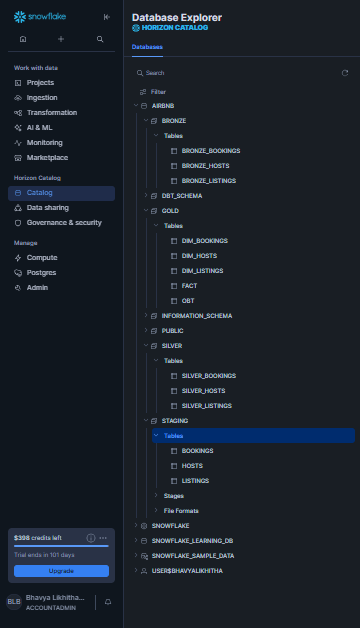

# Airbnb Data Engineering and Analytics Pipeline

End-to-end data pipeline project that ingests Airbnb CSV data from AWS S3, loads it into Snowflake, transforms it using dbt (Bronze → Silver → Gold), and serves business insights through a Looker Studio dashboard.

---

## Table of Contents

1. [Project Overview](#project-overview)
2. [Problem Statement](#problem-statement)
3. [Architecture](#architecture)
4. [Tech Stack](#tech-stack)
5. [Repository Structure](#repository-structure)
6. [Data Flow](#data-flow)
7. [AWS Setup (S3 + IAM)](#aws-setup-s3--iam)
8. [Snowflake Setup](#snowflake-setup)
9. [dbt Transformations](#dbt-transformations)
10. [Gold Data Model](#gold-data-model)
11. [Snapshots (SCD Type 2)](#snapshots-scd-type-2)
12. [Data Quality & Testing](#data-quality--testing)
13. [Looker Studio Dashboard](#looker-studio-dashboard)
14. [KPIs and Visualizations](#kpis-and-visualizations)
15. [How to Run the Project](#how-to-run-the-project)
16. [Security Best Practices](#security-best-practices)
17. [Performance & Cost Optimization](#performance--cost-optimization)
18. [Challenges & Learnings](#challenges--learnings)
19. [Future Improvements](#future-improvements)
20. [License](#license)
21. [Contact](#contact)

---

## Project Overview

This project demonstrates a modern analytics engineering workflow:

- Data is stored as raw CSV files in **AWS S3**.
- **Snowflake** loads raw data into warehouse tables via external stages.
- **dbt** applies layered transformations and modeling (Bronze → Silver → Gold).
- The **Gold layer** serves both a **star schema** (`FACT` + dimensions) and an **OBT** (One Big Table).
- **Looker Studio** consumes Gold models to build executive dashboards.

---

## Problem Statement

Raw Airbnb data is not directly analysis-ready due to quality issues, mixed granularity, and operational complexity.

This project solves that by creating a reproducible pipeline that:

- Standardizes ingestion from cloud storage.
- Applies business transformations and data quality checks.
- Supports historical tracking using dbt snapshots (SCD Type 2).
- Exposes consistent, analytics-ready datasets for BI reporting.

---

## Architecture


Optional Snowflake catalog reference:



---

## Tech Stack

| Component                    | Technology                        |
| ---------------------------- | --------------------------------- |
| Cloud Storage                | AWS S3                            |
| Access Control               | AWS IAM                           |
| Data Warehouse               | Snowflake                         |
| Transformation Framework     | dbt Core + dbt-snowflake adapter  |
| Language                     | SQL + Jinja (dbt macros/models)   |
| Environment/Dependency Mgmt  | `uv`                              |
| Dashboarding                 | Looker Studio                     |

---

## Repository Structure

```text
.
├── DDL/
│   ├── schema_creation.sql          # Base table DDL for Snowflake
│   └── resources.sql                # File format, stage, and COPY INTO commands
├── docs/
│   ├── architecture.png             # Architecture diagram
│   └── snowflake_catalog.png        # Snowflake catalog screenshot
├── airbnb_dbt_pipeline/
│   ├── dbt_project.yml              # dbt project configuration
│   ├── models/
│   │   ├── bronze/                  # Raw standardization models
│   │   ├── silver/                  # Cleaning and enrichment models
│   │   └── gold/                    # Analytics-ready models
│   │       ├── obt.sql              # One Big Table (wide denormalized)
│   │       ├── fact.sql             # Fact table
│   │       └── ephemeral/           # Ephemeral intermediate models
│   ├── snapshots/
│   │   ├── dim_bookings.yml         # SCD2 snapshot for bookings
│   │   ├── dim_hosts.yml            # SCD2 snapshot for hosts
│   │   └── dim_listings.yml         # SCD2 snapshot for listings
│   ├── macros/                      # Reusable Jinja macros
│   └── tests/                       # Custom data quality tests
├── pyproject.toml
├── requirements.txt
└── README.md
```

---

## Data Flow

```
Source CSV Files (S3)
       │
       ▼
┌──────────────────────┐
│  s3://airbnb-etl-    │
│  pipeline/source/    │
│  ├── bookings.csv    │
│  ├── listings.csv    │
│  └── hosts.csv       │
└──────────┬───────────┘
           │  Snowflake STAGE + COPY INTO
           ▼
┌──────────────────────┐
│  Snowflake Raw       │
│  Tables              │
│  ├── BOOKINGS        │
│  ├── LISTINGS        │
│  └── HOSTS           │
└──────────┬───────────┘
           │  dbt transformations
           ▼
┌──────────────────────────────────────┐
│  Bronze  →  Silver  →  Gold         │
│  (raw)     (clean)    (analytics)   │
│                                      │
│  Gold models:                        │
│  ├── OBT (One Big Table)            │
│  ├── FACT                           │
│  ├── DIM_BOOKINGS                   │
│  ├── DIM_LISTINGS                   │
│  └── DIM_HOSTS                      │
└──────────────────┬───────────────────┘
                   │
                   ▼
          Looker Studio Dashboard
```

---

## AWS Setup (S3 + IAM)

### S3

Create the bucket and upload source files:

- **Bucket:** `airbnb-etl-pipeline`
- **Prefix:** `source/`
- **Files:** `bookings.csv`, `listings.csv`, `hosts.csv`

### IAM

Choose one of the following approaches:

| Method                         | Description                                                    |
| ------------------------------ | -------------------------------------------------------------- |
| **IAM Role** *(recommended)*   | Attach to Snowflake external stage integration                 |
| **IAM User** *(quick setup)*   | Access key + secret key — avoid hardcoding in SQL              |

**Minimum S3 access policy** (principle of least privilege):

```json
{
  "Version": "2012-10-17",
  "Statement": [
    {
      "Sid": "ListBucket",
      "Effect": "Allow",
      "Action": ["s3:ListBucket"],
      "Resource": "arn:aws:s3:::airbnb-etl-pipeline"
    },
    {
      "Sid": "ReadObjects",
      "Effect": "Allow",
      "Action": ["s3:GetObject"],
      "Resource": "arn:aws:s3:::airbnb-etl-pipeline/source/*"
    }
  ]
}
```

---

## Snowflake Setup

### 1. Create Base Tables

Run `DDL/schema_creation.sql` to create the `BOOKINGS`, `LISTINGS`, and `HOSTS` tables.

### 2. Create File Format and Stage

From `DDL/resources.sql`:

```sql
CREATE FILE FORMAT IF NOT EXISTS csv_format
  TYPE = 'CSV'
  FIELD_DELIMITER = ','
  SKIP_HEADER = 1
  ERROR_ON_COLUMN_COUNT_MISMATCH = FALSE;

CREATE OR REPLACE STAGE snowstage
  FILE_FORMAT = csv_format
  URL = 's3://airbnb-etl-pipeline/source/';
```

### 3. Load Data into Raw Tables

```sql
COPY INTO BOOKINGS
FROM @snowstage
FILES = ('bookings.csv')
CREDENTIALS = (aws_key_id='<AWS_KEY_ID>', aws_secret_key='<AWS_SECRET_KEY>');

COPY INTO LISTINGS
FROM @snowstage
FILES = ('listings.csv')
CREDENTIALS = (aws_key_id='<AWS_KEY_ID>', aws_secret_key='<AWS_SECRET_KEY>');

COPY INTO HOSTS
FROM @snowstage
FILES = ('hosts.csv')
CREDENTIALS = (aws_key_id='<AWS_KEY_ID>', aws_secret_key='<AWS_SECRET_KEY>');
```

> **Note:** Replace `<AWS_KEY_ID>` and `<AWS_SECRET_KEY>` with your credentials, or use IAM role-based authentication (recommended).

---

## dbt Transformations

### Bronze Layer

**Purpose:** Source-level standardization and basic type casting.

- Maps raw Snowflake tables to dbt source models.
- Applies consistent column naming and data types.

### Silver Layer

**Purpose:** Cleaning, derived columns, and business-friendly normalization.

- Handles nulls, deduplication, and data corrections.
- Adds derived fields (e.g., calculated metrics, date parts).

### Gold Layer

**Purpose:** Analytics-ready datasets for BI and reporting.

**Key Gold models:**

| Model            | Description                                    |
| ---------------- | ---------------------------------------------- |
| `OBT`            | One Big Table — wide, denormalized for fast BI |
| `FACT`           | Central fact table for star schema             |
| `DIM_BOOKINGS`   | Booking dimension with SCD2 history            |
| `DIM_LISTINGS`   | Listing dimension with SCD2 history            |
| `DIM_HOSTS`      | Host dimension with SCD2 history               |

---

## Gold Data Model

Two consumption patterns are supported:

### OBT-First Analytics (Fast BI Setup)

- Single wide table for simpler Looker Studio charting.
- Best for: quick dashboard creation, ad-hoc analysis.

### Star Schema Analytics (Scalable)

- `FACT` + dimension tables for cleaner semantics and governance.
- Best for: advanced modeling, enterprise use cases, role-based access.

**Recommended BI default:**

| Use Case                          | Model                  |
| --------------------------------- | ---------------------- |
| Quick dashboard creation          | `AIRBNB.GOLD.OBT`     |
| Advanced modeling / enterprise    | `FACT` + `DIM_*`       |

---

## Snapshots (SCD Type 2)

Snapshots are defined in:

- `snapshots/dim_bookings.yml`
- `snapshots/dim_hosts.yml`
- `snapshots/dim_listings.yml`

They preserve historical changes using dbt's built-in snapshot strategy with `dbt_valid_from` / `dbt_valid_to` columns and current-row conventions.

Run snapshots with:

```bash
dbt snapshot
```

---

## Data Quality & Testing

Run standard dbt quality checks:

```bash
dbt test
```

**Suggested checks:**

| Test Type          | Details                                                       |
| ------------------ | ------------------------------------------------------------- |
| `unique`           | On business keys: `BOOKING_ID`, `LISTING_ID`, `HOST_ID`      |
| `not_null`         | On business keys: `BOOKING_ID`, `LISTING_ID`, `HOST_ID`      |
| `relationships`    | Between fact and dimension tables                             |
| `accepted_values`  | For `BOOKING_STATUS`                                          |

---

## Looker Studio Dashboard

### Live Dashboard

- **Report Link:** [Open Dashboard](https://lookerstudio.google.com/reporting/713b7567-f53d-47a1-8ecd-9fc900541e72)
- **Embed Link:** [Embed View](https://lookerstudio.google.com/embed/reporting/713b7567-f53d-47a1-8ecd-9fc900541e72/page/PqepF)

### Embed Snippet

```html
<iframe
  width="1000"
  height="700"
  src="https://lookerstudio.google.com/embed/reporting/713b7567-f53d-47a1-8ecd-9fc900541e72/page/PqepF"
  frameborder="0"
  style="border:0"
  allowfullscreen
  sandbox="allow-storage-access-by-user-activation allow-scripts allow-same-origin allow-popups allow-popups-to-escape-sandbox">
</iframe>
```

> **Note:** GitHub does not render iframe embeds in README view. Use the direct links above as fallback.

---

## KPIs and Visualizations

### KPI Cards

| KPI                  | Description                              |
| -------------------- | ---------------------------------------- |
| Total Revenue        | Sum of all booking revenue               |
| Total Bookings       | Count of all bookings                    |
| Avg Booking Value    | Average revenue per booking              |
| Avg Price per Night  | Average nightly rate across listings     |
| Superhost Share %    | Percentage of bookings from superhosts   |

### Core Charts

- Revenue over time (Year-Month trend)
- Breakdown by Property Type
- Price Segment Breakdown
- Top 5 Countries by Revenue
- Top 5 Cities by Revenue
- Pivot/Table for performance drill-down

### Suggested Global Filters

- `BOOKING_DATE`
- `COUNTRY`
- `CITY`
- `PROPERTY_TYPE`
- `ROOM_TYPE`
- `BOOKING_STATUS`

---

## How to Run the Project

### 1. Environment Setup

```bash
uv init
uv sync
uv add dbt-core
uv add dbt-snowflake
```

### 2. Initialize dbt Profile

Configure `profiles.yml` with your Snowflake credentials:

```yaml
airbnb_dbt_pipeline:
  target: dev
  outputs:
    dev:
      type: snowflake
      account: <your-account>
      user: <your-user>
      password: <your-password>
      role: <your-role>
      warehouse: <your-warehouse>
      database: AIRBNB
      schema: DEV
      threads: 4
```

### 3. Validate Connection

```bash
dbt debug
```

### 4. Build Models

```bash
dbt run        # Run all models
dbt test       # Run all tests
dbt snapshot   # Run snapshots
dbt build      # Run + test + snapshot in dependency order
```

**Optional scoped run:**

```bash
dbt run --select gold
```

---

## Security Best Practices

- **Do not** hardcode AWS keys in SQL scripts.
- Use **IAM roles** or a **secret management** service.
- Apply **least-privilege** IAM and Snowflake roles.
- Restrict production **write access by schema**.
- **Audit and rotate** credentials periodically.

---

## Performance & Cost Optimization

- Use appropriate **Snowflake warehouse sizes** per workload.
- Apply **partition logic by date** where applicable.
- **Materialize** heavy transformations as tables (not views).
- Keep dashboard queries aligned with **Gold-layer serving models**.
- Use **OBT for high-speed BI rendering** when join complexity is unnecessary.

---

## Challenges & Learnings

- Designing a reusable **Bronze/Silver/Gold framework** improves maintainability.
- Snapshot-based **SCD2 is crucial** for historical analytics.
- **OBT improves dashboard speed**; star schema improves governance and semantic clarity.
- **Macro/Jinja patterns** significantly reduce repetitive SQL.

---

## Future Improvements

- Add **orchestration** (Airflow / GitHub Actions) for automated runs.
- Implement **CI checks** for dbt tests on pull requests.
- Add **data freshness monitoring** and alerts.
- Generate a **documentation site** with `dbt docs`.
- Integrate **row-level security** for role-based BI access.

---